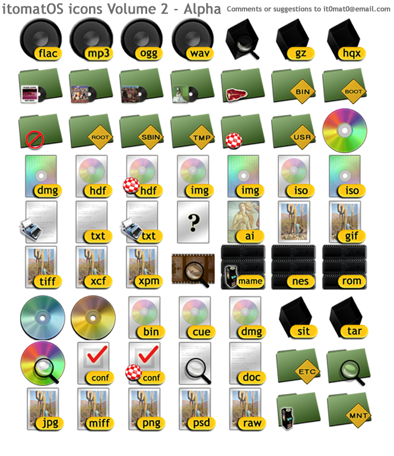

This is an Alpha set of the themes and stuff for the dufunct itomatOS

The old icons, Volume 2.

A GTK Theme that probably originated on Solaris

Some cursors inspired by NeXTStep/Mac OS X - with twists..

